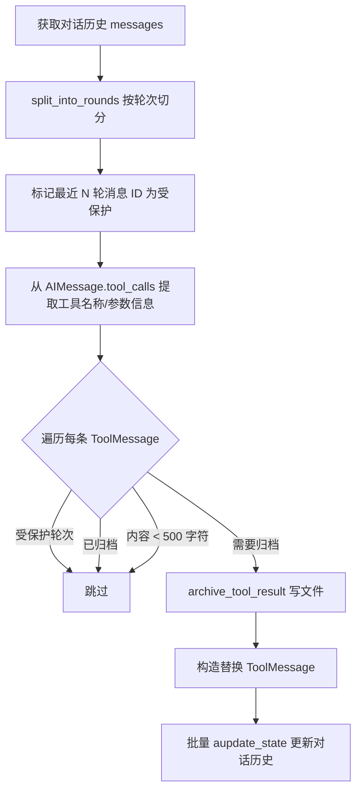

# ToolMessage 压缩方案

## 背景与问题

在多轮对话中，Agent 会频繁调用工具（如 `run_command`、`websearch` 等），每次工具调用的结果以 `ToolMessage` 的形式保存在对话历史中。随着对话轮次增加，这些 ToolMessage 会带来以下问题：

1. **上下文 Token 膨胀**：工具返回的结果通常很长（如搜索结果、命令输出），大量积累后会迅速撑满模型的上下文窗口
2. **性能下降**：每次 LLM 调用都要处理全部历史消息，输入 token 增多导致推理耗时和费用上升
3. **信息冗余**：早期轮次的工具结果对当前对话的参考价值递减，但仍占用大量 token

### 曾考虑的方案

| 方案 | 说明 | 问题 |
|------|------|------|
| **LLM 摘要压缩** | 调用轻量模型对超长 ToolMessage 生成摘要 | 不可逆、额外 LLM 开销、摘要可能丢失关键信息 |
| **裁剪旧轮次** | 直接删除最早的 N 轮对话 | 信息完全丢失、可能破坏 AIMessage ↔ ToolMessage 配对 |

最终选定的方案是 **文件归档 + 按需读取**，兼顾了 token 节省和信息可恢复性。

---

## 方案设计

### 核心思路

> 将超长的 ToolMessage 原文写入本地文件，在对话历史中替换为简短的归档标记。  
> 当 LLM 需要引用归档内容时，调用 `read_tool_result` 工具按需读取原文。

### 设计原则

1. **可恢复性**：原文保存在本地文件中，随时可通过 `read_tool_result` 工具读取完整内容
2. **保护最近轮次**：只归档较早轮次的 ToolMessage，最近 1 轮保持原样不动，确保 LLM 当前推理不受影响
3. **零 LLM 开销**：归档过程仅涉及文件 I/O，不调用任何大模型
4. **自动触发**：每次流式输出结束后自动执行，无需人工干预
5. **幂等安全**：已归档的消息会被跳过，多次执行不会重复处理

### 架构概览

```
┌─────────────────────────────────────────────────────────┐
│                     Agent (agent.py)                     │
│                                                         │
│  astream_text()                                         │
│    └─ 流结束后 → _archive_tool_results()                │
│         │                                               │
│         ├─ 1. 读取对话历史 messages                      │
│         ├─ 2. 按轮次切分（split_into_rounds）            │
│         ├─ 3. 标记最近 N 轮为受保护                      │
│         ├─ 4. 扫描非保护轮次的超长 ToolMessage            │
│         ├─ 5. 调用 archive_tool_result() 归档            │
│         └─ 6. 用归档标记替换原始 ToolMessage              │
│                                                         │
│  read_tool_result (闭包工具)                             │
│    └─ LLM 按需调用 → read_archived_tool_result()        │
└─────────────────────────────────────────────────────────┘
               │                          ▲
               ▼                          │
┌─────────────────────────────────────────────────────────┐
│          context_optimizer.py (工具模块)                  │
│                                                         │
│  archive_tool_result()    → 写文件 + 返回替换文本         │
│  read_archived_tool_result() → 读文件                    │
│  is_archived_tool_message()  → 判断是否已归档             │
│  split_into_rounds()         → 消息按轮次切分             │
└─────────────────────────────────────────────────────────┘
               │                          ▲
               ▼                          │
┌─────────────────────────────────────────────────────────┐
│              本地文件系统 (paths.py)                      │
│                                                         │
│  ~/.weclaw/sessions/<session_id>/tool_archive/           │
│    ├── <tool_call_id_1>.txt                             │
│    ├── <tool_call_id_2>.txt                             │
│    └── ...                                              │
└─────────────────────────────────────────────────────────┘
```

---

## 核心组件

### 1. `context_optimizer.py` — 上下文优化工具模块

文件路径：`src/weclaw/utils/context_optimizer.py`

#### 常量

| 常量名 | 值 | 说明 |
|--------|-----|------|
| `TOOL_ARCHIVE_MIN_LENGTH` | `500` | 内容长度阈值，低于此值的 ToolMessage 不归档 |
| `TOOL_ARCHIVE_PREFIX` | `"[Tool Result Archived]"` | 归档标记前缀，用于识别已归档的消息 |

#### 核心函数

##### `archive_tool_result(session_id, tool_call_id, tool_name, tool_args, content) → str`

将工具调用的完整结果写入本地文件，返回替换后的简短标记文本。

- **存储路径**：`~/.weclaw/sessions/<session_id>/tool_archive/<tool_call_id>.txt`
- **返回值示例**：

```
[Tool Result Archived] ID: call_abc123
Tool: run_command
Args: {'command': 'python3 -m weclaw.agent.mcp_client ...'}
Original content length: 2048 chars
To view full result, call read_tool_result with ID: call_abc123
```

##### `read_archived_tool_result(session_id, tool_call_id) → str`

从本地文件读取已归档的原始工具结果。文件不存在时返回错误提示。

##### `is_archived_tool_message(content) → bool`

判断 ToolMessage 内容是否以归档前缀开头，用于跳过已归档的消息避免重复处理。

##### `split_into_rounds(messages) → list[list]`

将消息列表按对话轮次切分：
- 每轮以 `HumanMessage` 开头，到下一个 `HumanMessage` 之前结束
- `SystemMessage` 独立成组，不计入对话轮次

### 2. `agent.py` — Agent 核心逻辑

文件路径：`src/weclaw/agent/agent.py`

#### `_ARCHIVE_SKIP_RECENT_ROUNDS = 1`

类属性，控制保护最近几轮不被归档。默认值 `1` 表示最近一轮对话的 ToolMessage 保持原文。

#### `_archive_tool_results()` — 归档入口

异步方法，在 `astream_text()` 流结束后自动调用。执行流程如下：



#### `read_tool_result` 工具 — 按需读取

通过工厂方法 `_create_read_tool_result_tool(session_id)` 创建，利用闭包捕获 `session_id`，注册为 Agent 的内置工具。

当 LLM 看到对话历史中的归档标记时，可以自主决定是否调用此工具读取原文。

### 3. `paths.py` — 路径管理

文件路径：`src/weclaw/utils/paths.py`

```
~/.weclaw/                              # 数据根目录
└── sessions/
    └── <session_id>/                   # 按会话隔离
        ├── checkpoint.db               # 对话检查点数据库
        └── tool_archive/               # 工具结果归档目录
            ├── call_abc123.txt
            ├── call_def456.txt
            └── ...
```

### 4. System Prompt 提示

在 Agent 初始化时，系统提示词中注入了归档机制的说明，让 LLM 知道如何处理归档标记：

```
## Tool Result Archive
In conversation history, some earlier tool call results have been archived.
You will see "[Tool Result Archived] ID: xxx" markers with tool name and args info.
If you need the full result, call the read_tool_result tool with the corresponding ID.
If the current question is unrelated to archived content, no need to read it.
```

---

## 实施步骤

以下按时间顺序记录了本方案的完整实施过程。

### Step 1: 创建路径工具函数

在 `src/weclaw/utils/paths.py` 中添加 `get_tool_archive_dir()` 函数：

```python
def get_tool_archive_dir(session_id: str = "main") -> Path:
    archive_dir = get_session_dir(session_id) / "tool_archive"
    archive_dir.mkdir(parents=True, exist_ok=True)
    return archive_dir
```

### Step 2: 实现上下文优化模块

在 `src/weclaw/utils/context_optimizer.py` 中实现以下函数：

1. **`split_into_rounds()`** — 将 messages 按 HumanMessage 切分为轮次
2. **`archive_tool_result()`** — 将原文写入 `<tool_call_id>.txt` 文件，返回归档标记
3. **`read_archived_tool_result()`** — 根据 tool_call_id 读取归档文件
4. **`is_archived_tool_message()`** — 通过前缀判断是否已归档

同时定义两个常量：
- `TOOL_ARCHIVE_MIN_LENGTH = 500`
- `TOOL_ARCHIVE_PREFIX = "[Tool Result Archived]"`

### Step 3: 在 Agent 中实现归档逻辑

在 `src/weclaw/agent/agent.py` 中：

1. **导入依赖**：从 `context_optimizer` 导入归档相关函数和常量
2. **添加 `_archive_tool_results()` 方法**：
   - 读取当前对话状态
   - 按轮次切分，标记最近 N 轮为受保护
   - 遍历非保护轮次的 ToolMessage，归档超长内容
   - 用归档标记替换原始 ToolMessage（通过 `aupdate_state`）
3. **在 `astream_text()` 末尾调用**：每次流式输出结束后自动触发

```python
# 流结束后自动清理上下文
await self._archive_tool_results()
```

### Step 4: 注册 `read_tool_result` 工具

在 `agent.py` 的 `init()` 方法中：

1. 通过 `_create_read_tool_result_tool(session_id)` 创建闭包工具
2. 将其注册到 Agent 的工具列表中
3. LLM 在看到归档标记时可自主调用此工具获取原文

```python
_read_tool_result = self._create_read_tool_result_tool(resolved_session_id)
tools = [run_command, read_local_file, read_skill, _read_tool_result, *(custom_tools or [])]
```

### Step 5: 配置 System Prompt

在系统提示词中添加归档机制的说明段落，让 LLM 理解：
- 什么是 `[Tool Result Archived]` 标记
- 何时需要调用 `read_tool_result` 工具
- 何时可以忽略归档内容

### Step 6: 清理废弃方案

移除了之前的两种旧方案代码：

1. **LLM 摘要压缩方案** (`_trim_error_tool_messages`)：
   - 删除 `_ERROR_MIN_LENGTH` 常量
   - 删除 `_ERROR_SUMMARY_PREFIX` 属性
   - 删除 `_is_tool_error()`、`_summarize_error()`、`_trim_error_tool_messages()` 方法

2. **裁剪旧轮次方案** (`_trim_old_rounds`)：
   - 删除 `_KEEP_RECENT_ROUNDS` 常量
   - 删除 `_trim_old_rounds()` 方法
   - 删除 `trim_old_rounds()` 函数及 `RemoveMessage` 导入

保留了 `summarize_text()` 函数供后续使用。

---

## 运行时流程

以一个完整的多轮对话为例，展示压缩方案的运行时行为：

```
第 1 轮：用户问 "搜索今天的军事新闻"
  → LLM 调用 run_command 执行搜索
  → ToolMessage 返回 2000 字符的搜索结果
  → 流结束 → _archive_tool_results()
  → 最近 1 轮受保护，不归档 ✅

第 2 轮：用户问 "帮我查一下北京的天气"
  → LLM 调用 run_command 执行搜索
  → ToolMessage 返回 1500 字符的天气信息
  → 流结束 → _archive_tool_results()
  → 第 1 轮不再受保护 → 2000 字符的搜索结果被归档
  → 替换为 ~150 字符的归档标记
  → 节省约 1850 字符（约 460 token） ✅

第 3 轮：用户问 "刚才搜索的军事新闻第一条是什么"
  → LLM 看到第 1 轮的归档标记，自动调用 read_tool_result
  → 读取归档文件，获得完整搜索结果
  → 基于完整结果回答用户 ✅
```

---

## 关键参数调优

| 参数 | 当前值 | 调优建议 |
|------|--------|----------|
| `TOOL_ARCHIVE_MIN_LENGTH` | 500 | 降低可以更激进地压缩，但可能影响 LLM 对短结果的直接利用 |
| `_ARCHIVE_SKIP_RECENT_ROUNDS` | 1 | 增大可以让更多轮次保持原文，但 token 节省效果减弱 |

---

## 方案对比总结

| 维度 | 文件归档方案（当前） | LLM 摘要方案（已废弃） | 裁剪旧轮次（已废弃） |
|------|---------------------|----------------------|---------------------|
| **可恢复性** | ✅ 原文可读取 | ❌ 不可逆 | ❌ 信息丢失 |
| **额外开销** | 仅文件 I/O | LLM 调用 | 无 |
| **保护机制** | 最近 N 轮不动 | 无保护 | 按轮次保留 |
| **适用范围** | 所有超长 ToolMessage | 仅错误消息 | 整轮对话 |
| **幂等性** | ✅ 已归档自动跳过 | ✅ 已摘要自动跳过 | ✅ 已裁剪不重复 |
| **信息线索** | 保留工具名、参数、长度 | 仅 LLM 摘要 | 完全丢失 |
